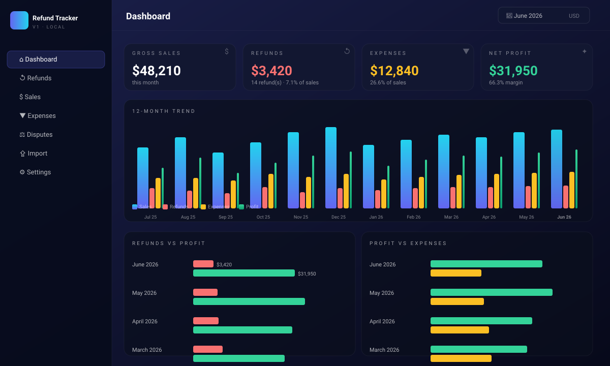

# Refund Tracker

A cross-platform app for tracking refunds, sales, expenses, profit, and
disputes for your e-commerce store. Ships as a single Progressive Web App
that installs on **Windows**, **Android**, and **iOS** from one codebase.



## What it does

- **Track refunds** — date, amount, platform, payment provider, reason,
  and status (Pending, Refunded, Disputed, Won, Lost). Each row links
  straight to the matching processor's dispute portal.
- **Track sales and expenses** the same way.
- **Monthly totals and trends** — gross sales, total refunds, total
  expenses, and net profit per month, plus a 12-month bar trend.
- **Profit vs expenses** and **refunds vs profit** comparison charts.
- **Dispute hub** — one-click deep-links into the merchant dispute
  consoles for PayPal, Stripe, Klarna, Shopify Payments, Square,
  Amazon Pay, Afterpay, Adyen, Authorize.Net, and Braintree.
- **CSV import** — drop a Shopify (or any platform's) orders export,
  map columns, ingest in seconds. Common Shopify column names auto-map.
- **Local-first storage** — all data lives in your browser
  (`localStorage`), backed up via JSON export from Settings.
- **Installs as a real app** on Windows / Android / iOS via the PWA
  install flow.
- **Native packaging** for the App Store, Play Store, and Microsoft
  Store via Capacitor / Tauri — see `docs/CAPACITOR.md` and
  `docs/WINDOWS.md`.

## Quick start (any platform)

The fastest path is to host the four files and open the URL on each
device. They're static files, so any free static host works.

### Host it (one-time)

| Host | Steps |
|---|---|
| **Netlify drop** | Drag the `refund-tracker/` folder onto [app.netlify.com/drop](https://app.netlify.com/drop). You get an HTTPS URL in 10 seconds. |
| **Vercel** | `npx vercel --prod` from inside `refund-tracker/`. |
| **GitHub Pages** | Make the repo public, enable Pages on `refund-tracker/` of any branch. |
| **Cloudflare Pages** | Connect the repo → set output directory to `refund-tracker`. |

### Install on each device

| Device | Steps |
|---|---|
| **Windows** | Open the URL in **Edge** or **Chrome** → click the install icon in the address bar (or `…` menu → Apps → Install this site as an app). The app gets a Start Menu entry and runs in its own window. |
| **Android** | Open in **Chrome** → `⋮` menu → **Install app** (or **Add to Home Screen**). |
| **iOS / iPadOS** | Open in **Safari** (other browsers can't install PWAs on iOS) → tap the **Share** icon → **Add to Home Screen**. |

After install, the app works offline thanks to the bundled service worker.

## Try it locally without hosting

You can open `index.html` directly in a desktop browser
(double-click). Most features work, but **service-worker registration
and the Install button are disabled on `file://`** — the browser only
treats the page as installable when served over `http://` or `https://`.

If you want install + offline support locally, run:

```bash
# from inside refund-tracker/
python3 -m http.server 8080
# then visit http://localhost:8080
```

## Native packaging (App Store / Play Store / Microsoft Store)

- iOS + Android via Capacitor &mdash; see [docs/CAPACITOR.md](docs/CAPACITOR.md)
- Windows `.msi` via Tauri &mdash; see [docs/WINDOWS.md](docs/WINDOWS.md)

## Live integrations (the parts that need a backend)

| Provider | Today | What it would take |
|---|---|---|
| Shopify | CSV import (works) | A tiny backend (Cloudflare Worker, Vercel function, or any Node host) that holds the Admin API token and exposes `GET /orders` and `GET /refunds`. The app already has a slot in Settings to point at the URL. |
| Stripe | Dispute deep-link (works) | Same — a backend with a restricted Stripe key listing `disputes` and `refunds`. |
| PayPal | Dispute deep-link (works) | OAuth merchant integration is non-trivial; the deep-link hub is the practical answer for solo merchants. |
| Klarna | Dispute deep-link (works) | Same as PayPal — Klarna requires a server-to-server merchant integration. |

OAuth secrets must never live in client-side code, which is why these
integrations need a tiny backend. The app is designed to plug into one
when you're ready, but ships fully usable today via CSV + dispute
deep-links.

## Files

```
refund-tracker/
  index.html             # the app — React + htm + Tailwind via CDN
  manifest.webmanifest   # PWA manifest (name, icons, shortcuts)
  sw.js                  # service worker (offline shell cache)
  icons/                 # SVG app icons (192, 512, maskable)
  docs/
    CAPACITOR.md         # iOS & Android native packaging
    WINDOWS.md           # Windows packaging via Tauri
    dashboard.svg        # screenshot for this README
```

## Privacy note

By default everything stays on your device — there is no network call
home, no analytics, no third-party tracking. The only outbound traffic
is the dispute-portal links you click in the Disputes page (which open
in a new tab) and the CDN that loads React, Tailwind, and `htm`. Bundle
those locally per `docs/CAPACITOR.md` if you need an offline-first build
with no third-party CDN dependency.
